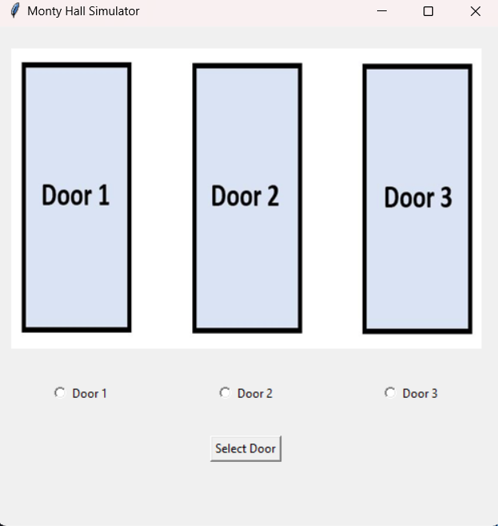

# Monty Hall Simulator

This is a Monty Hall Simulator implemented in Python using the Tkinter library. The Monty Hall problem is a famous probability puzzle that demonstrates the concept of conditional probability. The simulator allows you to play multiple rounds of the game and see the outcomes based on different strategies.

## Description

The Monty Hall Simulator is a graphical application built with Tkinter, a Python GUI toolkit. It presents three doors to the user, behind one of which is a valuable prize (e.g., a car), while the other doors contain goats. The game proceeds as follows:

1. The user selects one of the doors.
2. The host (simulated by the program) opens one of the other doors, revealing a goat.
3. The user is then given the option to switch their choice or stick with their initial selection.
4. The program reveals whether the user has won the prize or not.

The simulator demonstrates that statistically, it is advantageous to switch doors after the host reveals a goat. The program uses random selection to determine the initial placement of the prize and the host's choice of door to open.

## Usage

1. Clone the repository:

   ```
   git clone https://github.com/Timmapuram-Karthik/Monty-Hall-Simulator
   ```

2. Change into the project directory:

   ```
   cd Monty-Hall-Simulator
   ```

3. Run the Python script:

   ```
   python Monty_Hall_Simulator.py
   ```

4. The application window will appear, displaying three doors and an image representing the Monty Hall game. Select one of the doors by clicking on the corresponding radio button.
5. After selecting a door, the host will open one of the other doors, revealing a goat. A message box will display the opened door number.
6. You will be prompted to decide whether to switch your choice or stick with your initial selection. Click "Yes" to switch or "No" to stick.
7. The final result will be displayed in a message box, indicating whether you won the car or not.
8. Play multiple rounds by repeating the steps above.

## Screenshots



## Contributing

Contributions are welcome! If you find any issues or have suggestions for improvement, please open an issue or submit a pull request.

## License

This project is licensed under the MIT License. See the [LICENSE](LICENSE) file for details.
